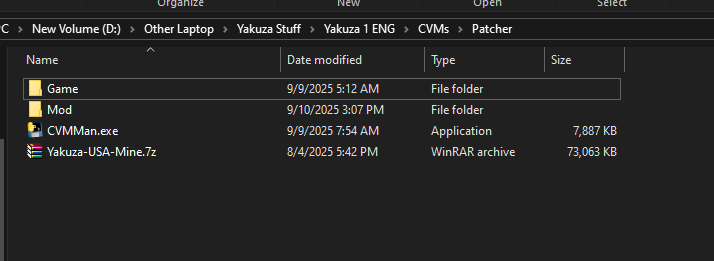
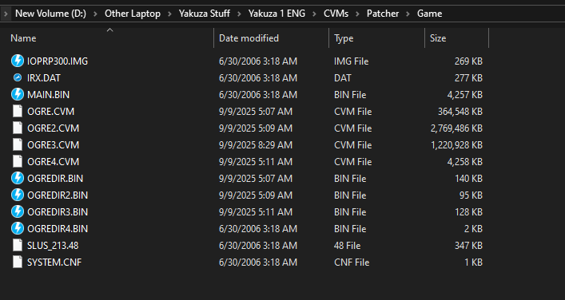
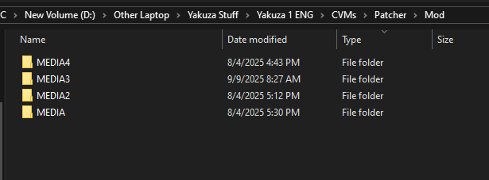
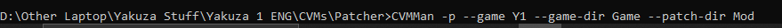
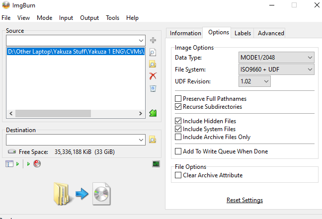

# CVMMan
PS2 Yakuza CVM unpacker and repacker

# Usage
# Patching:
- CVMMan -p --game "Y1/Y2_1/Y2_2" --patch-dir "YOUR-MOD-FOLDER" --game-dir "YOUR-GAME-FOLDER"
## Example:
- Setup:

- Game Folder:

- Mod folder:

-Patching Command:

## Requirements:
- Game folder containing all PS2 game files
- Mod folder containing MEDIA folders
# Extracting:
- CVMMan -u --cvm-file "YOUR-CVM" --dir-file "YOUR-OGREDIR"
# Repacking:
- CVMMan -r --list-file "YOUR-LIST.JSON"

# Modding the game:

- Extract the game into a folder using 7zip/winrar
- Patch/Repack a cvm
- Open ImgBurn, Create ISO from files and select all files in the game folder (if any NEW_ cvm/dir exists, rename it)
- Use settings:

## Requirements:
- 7zip or WinRar
- ImgBurn, an ISO tool